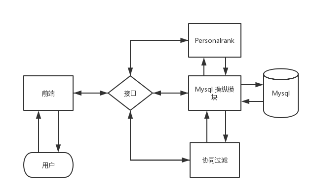

# 设计文档
<br>
本项目使用Movielens数据集，总有900以上的用户和1900条以上的电影数量。并且，有多达7万条以上的电影评分记录。这给我们带来了准确推荐用户感兴趣电影的可能性。<br><br>
项目除了前端以外，均采用python3开发。本项目组成员共有两名，一名负责前端后台，另一个负责数据库和推荐算法的实现。<br>
## 项目类设计
项目中使用类的概念，项目中设计了三个类。其中最基本的是电影类，如下，类定义所在代码文件[system_object](system_object.py)
```python
# Movies Object
class Movies(object):
    def __init__(self, _Mid=-1, _Socre=-1):
        # 电影ID
        self.Mid = _Mid
        # 在用户类中起作用，用户对电影的评分
        self.user_score = _Socre
        # 电影的平均评分
        self.average_score = -1
        # 电影名字
        self.Name = ''
        # 海报外网地址
        self.post = ''
        # 海报本地地址
        self.local_post = ''
        # 上映日期
        self.release_data = ''
```
另外两个类分别是用户类和电影详情类：
```python
# User object
class User():
    def __init__(self, ID):
        # 用户ID
        self.ID = ID
        # 用户名
        self.name = ''
        # 用户电影列表
        self.movies = []

    def is_authenticated(self):
        return True

    def is_active(self):
        return True

    def is_anonymous(self):
        return False

    def get_id(self):
        return self.ID
# Movies Detail object
class MoviesDetail(object):
    def __init__(self):
        # 电影基本类
        self.base = Movies()
        # 观看次数
        self.watch_time = -1
        # 以下是我所需要的，有重复的你进行合并
        # 导演
        self.director = ''
        # 编剧
        self.creator = ''
        # 主演
        self.stars = ''
        # 类型       （相当于你定义的电影类别）
        # 电影类别
        self.kind = ''
        # 制片国家/地区
        self.country = ''
        # 语言
        self.language = ''
        # 片长 以分钟为单位 -1 为未获取到
        self.runtime = -1
        # 评分 (为电影的评价评分，见电影基本类)
        # 剧情简介    （相当于你定义的电影故事线）# 电影故事线
        self.story = ''
        # 电影播放链接 （相当于你定义的电影跳转链接）# 电影跳转链接
        self.url = ''
```
## 项目框架及逻辑
项目数据库和前端独立，算法嵌入在数据库操纵程序中。
整体框架如：

数据库采用mysql，所有功能将采用模块化设计。在后端数据库操纵程序中有用户模块，电影模块，数据库操纵模块。后台所有有关模块详情见[recommend](./recommend)。前端及后端逻辑采用python库中的flask框架，详情见[flask](./web_recommend/flask-gentelella)。有关flask更详细的信息：[flask](http://flask.pocoo.org/docs/1.0/)
## 接口
后端和数据库互不干涉，他们之间的交互将通过一多个接口传递信息。由于本项目完全使用python语言，这里将接口定义为函数的形式。所有接口将定义在一个 接口文件[interface](interface.py)中。
例如请求判断是否允许用户登陆的接口：
```python
def accessCheck(name, password):
    """
        用户登陆检测，检测用户及密码是否正确
        传入用户名字符串， 密码字符串
        允许登陆返回 用户ID
        密码或用户名错误返回 0
        没有用户返回 -1 提示用户可以注册
    """ 
    return _init_users.accessCheck(name,password)

```
## 数据库设计
数据库分为用户数据库[recommend_users](./source/data/recommend_users.sql)和电影数据库[recommend](./source/data/recommend.sql)<br>
在数据库recommend_users中，维护了一张用户对电影的打分表，一张电影详情表，一张两两用户相似表和一张计算好的用户被推荐的电影表。在recommend数据库中维护了一张用户信息表
## 物理组织
[interface.py](interface.py) 里面定义了接口函数，前端所有需要的以及要更改的数据请从这里开始,需要另外的功能请自行在这里添加，并详细说明。<br>

[system_object.py](system_object.py) 里定了数据结构的组成形式<br>

[spider](./spider) 存放爬虫<br>
[recommend](./recommend)中实现了系统的数据库逻辑部分<br>

web文件将全部放在[web_recommend](./web_recommend/flask-gentelella)文件夹中。<br>
项目设计了命令行系统界面[view_test](view_test.py)<br>

## 任务分配
Lyy(李运遥) 的程序将在recommend文件夹里<br>
Ch(程慧) 的程序将在Recommend_system_python 根目录和web_recommend文件夹下，如若需要请自行建立文件夹，并把文件夹的作用在这里注明。
## 开发系统与IDE
Lyy 采用Linux Mint 18.2系统，Vim IDE
Ch 采用Ubuntu 16.0系统，Pycharm IDE